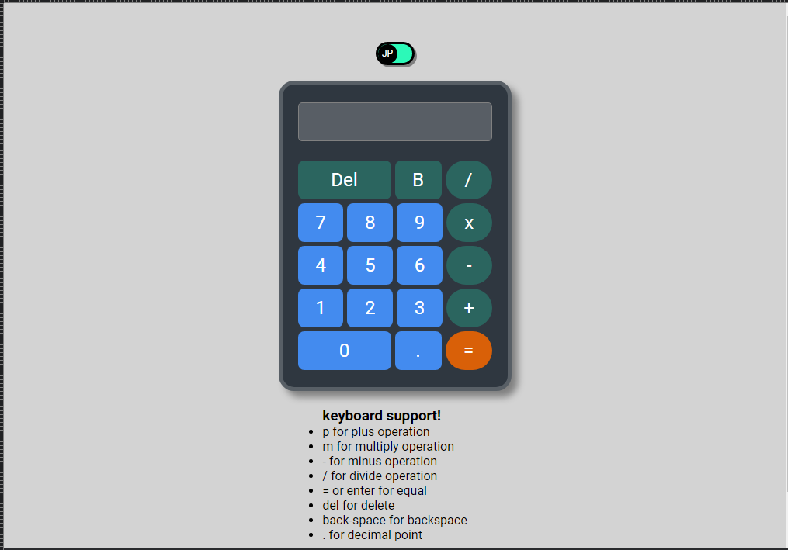
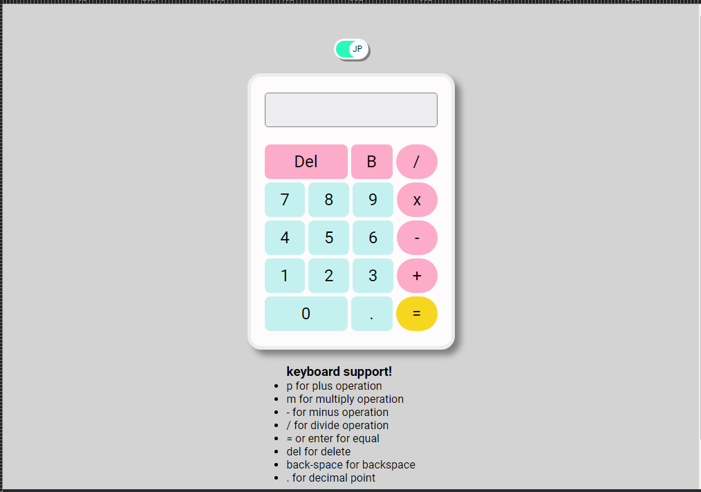

# calculator
 - This project was greated to create a simple calculator that have a feature as a challenge given by The Odin Project.

## Wireframe:
    

## Live Preview URL: https://narvs1999.github.io/calculator/

##Dark Mode / Light Mode

 

## Technology I used:

#### HTML5

#### CSS3

#### JavaScript
    JavaScript Function
    JavaScript Event

## Objectives (from: https://www.theodinproject.com/lessons/foundations-calculator)

    1. have function 
        for addition
        for subtraction
        for multiplication
        for divition
        
     2. have a fuction the operate a 2 number then call a operation fucntion
     
     3. Create a layout for basic calculator
     
     4. Create an event, that show a number on screen when day click a specific button.
     
     5.  (+) Add a floating point number button with function
        then make sure the floating point is only one per set of number
        
     6. (+) design a layout to make nice
     
     7. (+) add a backspace button with function 
     
     8. (+) add a delete button with function
     
     9. (+) add a keyboard support
     
     10. (+) add a darktheme
     
 ## Features/Scope:
    1. Simple Calculator 
    2. light mode/dark mode
    3. keyboard support
